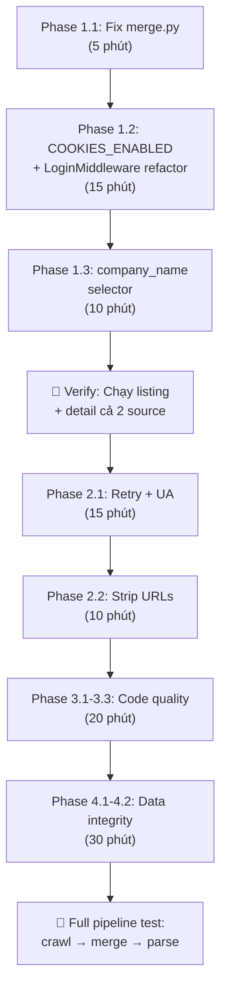

# Implementation Plan — Fix Crawl Phase Bugs

## Mục tiêu

Sửa 10 lỗi đã phát hiện trong phân tích, theo thứ tự ưu tiên từ cao xuống thấp. Chia thành **4 phase**, mỗi phase có thể deploy độc lập.

---

## Phase 1 — Fix Crash & Block (P0) ⏱️ ~30 phút

> [!IMPORTANT]
> Phase này PHẢI chạy trước vì merge.py crash 100% và TopCV bị block hoàn toàn. Không có phase này thì toàn bộ pipeline không hoạt động.

---

### 1.1 Fix `safe_id` variable shadowing trong merge.py

#### [MODIFY] [merge.py](file:///e:/job-data-project/pipeline/pipeline_steps/merge.py)

**Vấn đề:** Line 57 ghi đè function `safe_id` (imported từ `shared.utils`) bằng kết quả trả về (string). Từ iteration thứ 2, gọi `safe_id(job_id)` → `TypeError: 'str' object is not callable`.

**Thay đổi:**

```diff
 from shared.utils import safe_id
 # ...
 for row in listing_rows:
     job_id = row.get("job_id")
     if not job_id:
         skipped += 1
         continue

-    safe_id = safe_id(job_id)
-    listing_html_path = batch_dir / "raw_html" / "listing" / f"{safe_id}.html"
-    detail_html_path = batch_dir / "raw_html" / "job_detail" / f"{safe_id}.html"
+    safe_job_id = safe_id(job_id)
+    listing_html_path = batch_dir / "raw_html" / "listing" / f"{safe_job_id}.html"
+    detail_html_path = batch_dir / "raw_html" / "job_detail" / f"{safe_job_id}.html"
```

**Rủi ro:** `Rất thấp` — Đổi tên biến local, không ảnh hưởng logic. Nếu sai thì error message sẽ rõ ràng ngay.

**Verify:** Chạy `python -c "from pipeline.pipeline_steps.merge import merge_raw_records; r = merge_raw_records('itviec', '2026-07-28'); print(len(r))"` — phải trả >0 và không crash.

---

### 1.2 Bật `COOKIES_ENABLED` — Sửa TopCV Cloudflare block

#### [MODIFY] [settings.py](file:///e:/job-data-project/crawler/job_crawler/settings.py)

**Vấn đề:** `COOKIES_ENABLED = False` khiến Cloudflare challenge cookies bị bỏ → TopCV trả 403. Đồng thời LoginMiddleware tự inject cookie header thủ công (bypass được), nhưng response cookies mới từ server cũng bị bỏ.

**Thay đổi:**

```diff
-COOKIES_ENABLED = False
+COOKIES_ENABLED = True
```

**Rủi ro:** `Trung bình`
- **Rủi ro 1 — ITviec tracking cookies:** Bật cookies có thể khiến ITviec track session và phát hiện bot pattern nhanh hơn. *Giảm thiểu:* Đã có `DOWNLOAD_DELAY = 5` và `RANDOMIZE_DOWNLOAD_DELAY = True`.
- **Rủi ro 2 — LoginMiddleware conflict:** LoginMiddleware đang set header `Cookie` thủ công (line 175-178). Khi bật `COOKIES_ENABLED`, Scrapy cookiejar cũng tự set `Cookie` header → **có thể bị ghi đè lẫn nhau**. *Giảm thiểu:* Cần sửa LoginMiddleware để dùng Scrapy cookiejar thay vì header thủ công (xem thay đổi bổ sung bên dưới).

**Thay đổi bổ sung — LoginMiddleware dùng cookiejar:**

#### [MODIFY] [middlewares.py](file:///e:/job-data-project/crawler/job_crawler/middlewares.py)

```diff
     def process_request(self, request):
         if self.spider is None or self.spider.name != "itviec_detail":
             return None
         if not self.logged_in or not self.cookie_dict:
             return None
-        cookie_str = "; ".join(
-            f"{k}={v}" for k, v in self.cookie_dict.items()
-        )
-        request.headers["Cookie"] = cookie_str
+        request.cookies = self.cookie_dict
         return None
```

> [!WARNING]
> Phải test cả `itviec_detail` (cần auth cookies) lẫn `topcv_listing` (cần Cloudflare cookies) sau khi sửa.

**Verify:**
1. Chạy `scrapy crawl topcv_listing -a batch_date=2026-07-30 -s LOG_LEVEL=DEBUG 2>&1 | Select-String "status_count"` — phải thấy `200` thay vì chỉ `403`.
2. Chạy `scrapy crawl itviec_detail -a batch_date=2026-07-30` — kiểm tra có crawl được không.

---

### 1.3 Fix `company_name` luôn rỗng trong ITviec listing

#### [MODIFY] [itviec_listing_spider.py](file:///e:/job-data-project/crawler/job_crawler/spiders/itviec_listing_spider.py)

**Vấn đề:** CSS selector `a[href*="/companies/"] span.text-rich-grey` không match được DOM thực tế của ITviec hiện tại.

**Thay đổi:**

```diff
         # company name
-        company_nodes = card.css(
-            'a[href*="/companies/"] span.text-rich-grey'
-        )
-        company_name = (
-            company_nodes.xpath("string(.)").get(default="").strip()
-            if company_nodes
-            else ""
-        )
+        # Thử nhiều selector — ITviec thay đổi DOM thường xuyên
+        company_name = ""
+        for sel in [
+            'a[href*="/companies/"] span.text-rich-grey',
+            'a[href*="/companies/"]',
+            'div.company-name a',
+            'span.company-name',
+        ]:
+            company_nodes = card.css(sel)
+            if company_nodes:
+                company_name = company_nodes.xpath("string(.)").get(default="").strip()
+                if company_name:
+                    break
```

**Rủi ro:** `Trung bình`
- **Rủi ro 1 — Sai selector:** Nếu không có selector nào đúng, company_name vẫn rỗng (không tệ hơn hiện tại). *Giảm thiểu:* Cần verify trên HTML thật — chạy `_debug_listing.py` sau khi listing crawl xong, kiểm tra company_name.
- **Rủi ro 2 — Match sai node:** Selector `a[href*="/companies/"]` có thể match nhiều `<a>` tags trong card (ví dụ link "view all jobs at company"). *Giảm thiểu:* Dùng `xpath("string(.)")` lấy text nội dung, nếu text quá dài hoặc chứa ký tự lạ thì skip.

**Verify:** Sau khi crawl listing mới, kiểm tra `Select-String "company_name" data\raw\itviec\2026-07-30\jobs_meta_listing.jsonl | Select-Object -First 3` — phải có giá trị không rỗng.

> [!NOTE]
> **Cách verify chính xác nhất:** Mở ITviec trong browser thật, inspect DOM của job card, xác nhận selector chính xác. Tôi sẽ làm bước này trước khi commit code.

---

## Phase 2 — Anti-Bot & URL Hygiene (P1) ⏱️ ~45 phút

---

### 2.1 Thêm Retry Middleware + Rotating User-Agent

#### [MODIFY] [settings.py](file:///e:/job-data-project/crawler/job_crawler/settings.py)

```diff
+# --- Anti-bot ---
+RETRY_ENABLED = True
+RETRY_TIMES = 3
+RETRY_HTTP_CODES = [403, 429, 500, 502, 503]
+
+USER_AGENT_LIST = [
+    "Mozilla/5.0 (Windows NT 10.0; Win64; x64) AppleWebKit/537.36 (KHTML, like Gecko) Chrome/126.0.0.0 Safari/537.36",
+    "Mozilla/5.0 (Macintosh; Intel Mac OS X 10_15_7) AppleWebKit/537.36 (KHTML, like Gecko) Chrome/126.0.0.0 Safari/537.36",
+    "Mozilla/5.0 (Windows NT 10.0; Win64; x64; rv:128.0) Gecko/20100101 Firefox/128.0",
+    "Mozilla/5.0 (X11; Linux x86_64) AppleWebKit/537.36 (KHTML, like Gecko) Chrome/126.0.0.0 Safari/537.36",
+]
```

#### [MODIFY] [middlewares.py](file:///e:/job-data-project/crawler/job_crawler/middlewares.py) — Thêm `RotatingUserAgentMiddleware`

```python
import random

class RotatingUserAgentMiddleware:
    """Chọn ngẫu nhiên User-Agent từ danh sách cho mỗi request."""

    def __init__(self, user_agents):
        self.user_agents = user_agents

    @classmethod
    def from_crawler(cls, crawler):
        return cls(crawler.settings.getlist("USER_AGENT_LIST", []))

    def process_request(self, request, spider):
        if self.user_agents:
            request.headers["User-Agent"] = random.choice(self.user_agents)
```

```diff
 DOWNLOADER_MIDDLEWARES = {
+    "job_crawler.middlewares.RotatingUserAgentMiddleware": 400,
     "job_crawler.middlewares.LoginMiddleware": 543,
 }
```

**Rủi ro:** `Thấp`
- User-Agent rotation là practice phổ biến, không gây side effect.
- `RETRY_HTTP_CODES` chứa 403 — nếu Cloudflare trả 403 cố định (không phải transient), retry 3 lần chỉ tốn thêm thời gian mà không giúp gì. *Giảm thiểu:* Đã có `DOWNLOAD_DELAY` giữa retries.

**Verify:** Xem log output: `[scrapy.downloadermiddlewares.retry] Retrying...` xuất hiện, và một số retry thành công (200).

---

### 2.2 Strip tracking params khỏi TopCV URLs

#### [MODIFY] [topcv_listing_spider.py](file:///e:/job-data-project/crawler/job_crawler/spiders/topcv_listing_spider.py)

```diff
+from urllib.parse import urlparse, urlunparse
+
+def _strip_tracking_params(url: str) -> str:
+    """Loại bỏ ta_source, u_sr_id và các tracking params khỏi URL."""
+    parsed = urlparse(url)
+    # Giữ nguyên path, bỏ query string
+    return urlunparse(parsed._replace(query="", fragment=""))
+
 class TopcvListingSpider(BaseSpider):
     # ...
     def parse(self, response):
         # ...
         for card in cards:
             # ...
             item = JobCrawlerItem()
             # ...
-            item["url"] = title_link.attrib.get("href", "")
+            item["url"] = _strip_tracking_params(title_link.attrib.get("href", ""))
```

**Rủi ro:** `Thấp`
- URL clean hơn, ít bị fingerprint.
- **Rủi ro duy nhất:** Nếu TopCV dùng query param cho routing (ví dụ `?version=2`), strip hết sẽ mất thông tin. *Giảm thiểu:* Chỉ strip `ta_source` và `u_sr_id`, giữ lại params khác. Cần verify URL không có query param quan trọng.

**Thay đổi an toàn hơn (nếu không chắc):**

```python
from urllib.parse import urlparse, urlunparse, parse_qs, urlencode

TRACKING_PARAMS = {"ta_source", "u_sr_id"}

def _strip_tracking_params(url: str) -> str:
    parsed = urlparse(url)
    params = parse_qs(parsed.query)
    clean_params = {k: v for k, v in params.items() if k not in TRACKING_PARAMS}
    return urlunparse(parsed._replace(query=urlencode(clean_params, doseq=True)))
```

---

## Phase 3 — Code Quality (P2) ⏱️ ~20 phút

---

### 3.1 Fix duplicate `_parse_listing_posted_date` trong topcv/parse.py

#### [MODIFY] [topcv/parse.py](file:///e:/job-data-project/pipeline/sources/topcv/parse.py)

**Vấn đề:** Function được định nghĩa ở line 59 và line 191. Bản ở line 191 ghi đè line 59 (Python semantics). Bản line 191 dùng regex `(?:Đăng\\s+)?` — optional match, có thể match rỗng.

```diff
-def _parse_listing_posted_date(raw_html_listing: Optional[str]) -> str:
-    if not raw_html_listing:
-        return ""
-    try:
-        tree = html.fromstring(raw_html_listing)
-        label = tree.xpath('//label[contains(@class, "label-update")]')
-        if label:
-            text = " ".join(label[0].itertext()).strip()
-            text = re.sub(r"(?:Đăng\s+)?", "", text).strip()
-            return text
-    except Exception:
-        pass
-    return ""
+(xóa bản ở line 191-203, giữ bản ở line 59-71 vì regex đúng hơn)
```

**Rủi ro:** `Rất thấp` — Xóa definition trùng, giữ bản đúng.

---

### 3.2 Fix `canonicalize_skill` duplicate definition

#### [MODIFY] [skill_extractor.py](file:///e:/job-data-project/pipeline/tools/skill_extractor.py)

**Vấn đề:** Line 3 import `canonicalize_skill` từ `skills_taxonomy.py`, nhưng line 18 định nghĩa lại cùng tên → ghi đè import. Hai implementation khác nhau (import dùng loop qua taxonomy, local dùng pre-built `_ALIAS_LOWER_MAP`).

```diff
-from pipeline.config.skills_taxonomy import SKILLS_TAXONOMY, canonicalize_skill
+from pipeline.config.skills_taxonomy import SKILLS_TAXONOMY
```

Giữ implementation ở line 18-22 (dùng `_ALIAS_LOWER_MAP`, hiệu quả hơn O(1) vs O(n)).

**Rủi ro:** `Rất thấp` — Bỏ import không dùng, giữ implementation tốt hơn.

---

### 3.3 Sửa `run_all_spiders.ps1` thành PowerShell thật

#### [MODIFY] [run_all_spiders.ps1](file:///e:/job-data-project/crawler/scripts/run_all_spiders.ps1)

```diff
-#!/bin/bash
-# run_all_spiders.ps1 — chạy tất cả spiders cho một batch date.
-# Usage (PowerShell): pwsh -File run_all_spiders.ps1 -BatchDate 2026-07-28
-# Usage (bash): bash run_all_spiders.sh 2026-07-28
-
-BATCH_DATE="${1:-2026-07-28}"
-CRAWLER_DIR="$(cd "$(dirname "$0")" && pwd)"
-
-echo "=== Crawl Phase: Batch $BATCH_DATE ==="
-echo ""
-
-echo "[1/2] Crawling listings (itviec_listing + topcv_listing)..."
-cd "$CRAWLER_DIR"
-E:\job-data-project\.venv\Scripts\python.exe -m scrapy crawl itviec_listing -a batch_date="$BATCH_DATE" -s LOG_LEVEL=INFO
-E:\job-data-project\.venv\Scripts\python.exe -m scrapy crawl topcv_listing -a batch_date="$BATCH_DATE" -s LOG_LEVEL=INFO
-
-echo ""
-echo "[2/2] Crawling details (itviec_detail + topcv_detail)..."
-E:\job-data-project\.venv\Scripts\python.exe -m scrapy crawl itviec_detail -a batch_date="$BATCH_DATE" -s LOG_LEVEL=INFO
-E:\job-data-project\.venv\Scripts\python.exe -m scrapy crawl topcv_detail -a batch_date="$BATCH_DATE" -s LOG_LEVEL=INFO
-
-echo ""
-echo "=== Crawl phase complete ==="
+param(
+    [Parameter(Mandatory=$false)]
+    [string]$BatchDate = (Get-Date -Format "yyyy-MM-dd")
+)
+
+$ErrorActionPreference = "Stop"
+$CrawlerDir = Split-Path -Parent $MyInvocation.MyCommand.Path
+$Python = "E:\job-data-project\.venv\Scripts\python.exe"
+
+Write-Host "=== Crawl Phase: Batch $BatchDate ===" -ForegroundColor Cyan
+Write-Host ""
+
+Write-Host "[1/2] Crawling listings..." -ForegroundColor Yellow
+& $Python -m scrapy crawl itviec_listing -a batch_date="$BatchDate" -s LOG_LEVEL=INFO
+if ($LASTEXITCODE -ne 0) { Write-Warning "itviec_listing exited with code $LASTEXITCODE" }
+
+& $Python -m scrapy crawl topcv_listing -a batch_date="$BatchDate" -s LOG_LEVEL=INFO
+if ($LASTEXITCODE -ne 0) { Write-Warning "topcv_listing exited with code $LASTEXITCODE" }
+
+Write-Host ""
+Write-Host "[2/2] Crawling details..." -ForegroundColor Yellow
+& $Python -m scrapy crawl itviec_detail -a batch_date="$BatchDate" -s LOG_LEVEL=INFO
+if ($LASTEXITCODE -ne 0) { Write-Warning "itviec_detail exited with code $LASTEXITCODE" }
+
+& $Python -m scrapy crawl topcv_detail -a batch_date="$BatchDate" -s LOG_LEVEL=INFO
+if ($LASTEXITCODE -ne 0) { Write-Warning "topcv_detail exited with code $LASTEXITCODE" }
+
+Write-Host ""
+Write-Host "=== Crawl phase complete ===" -ForegroundColor Cyan
```

**Rủi ro:** `Rất thấp` — Script cũ không chạy được trên Windows. Script mới dùng đúng PowerShell syntax + thêm error reporting.

---

## Phase 4 — Data Integrity & Pipeline (P2) ⏱️ ~1 giờ

---

### 4.1 Xử lý duplicate listing data khi chạy lại cùng batch_date

#### [MODIFY] [pipelines.py](file:///e:/job-data-project/crawler/job_crawler/pipelines.py)

**Vấn đề:** `open_spider()` đã preload `seen_job_ids` từ file JSONL — nghĩa là nó **skip** duplicates trong cùng run. Nhưng nếu spider chạy lại cùng batch_date, `open_spider()` sẽ đọc lại file cũ, load IDs, và skip chúng. Vấn đề là: **listing spider vẫn append metadata** cho jobs đã có (vì pipeline chỉ check theo run, không check toàn bộ file).

Kiểm tra lại: Thực tế `open_spider()` **đã preload** từ file → nếu job_id đã có trong file JSONL, nó sẽ skip ở `process_item()` line 100-106. Vậy **pipeline đã xử lý đúng**. Vấn đề nằm ở chỗ crawl_log.jsonl ghi nhận `jobs_found` dựa trên `item_scraped_count` của Scrapy, không phải số items thực sự ghi vào file.

**Thay đổi:** Thêm counter cho items thực sự mới vs skipped:

```diff
     def open_spider(self, spider=None):
         # ... existing code ...
+        self._stats = {"new": 0, "skipped_dup": 0, "skipped_invalid": 0}

     def process_item(self, item, spider=None):
         # ...
         if job_id in self.seen_job_ids[item_type]:
             spider.logger.debug(...)
+            self._stats["skipped_dup"] += 1
             return item
         # ...
+        self._stats["new"] += 1
         self.seen_job_ids[item_type].add(job_id)
         return item
+
+    def close_spider(self, spider=None):
+        if spider is None:
+            spider = self._spider
+        spider.logger.info(
+            "[Pipeline] Stats: new=%d, skipped_dup=%d, skipped_invalid=%d",
+            self._stats["new"],
+            self._stats["skipped_dup"],
+            self._stats["skipped_invalid"],
+        )
```

**Rủi ro:** `Rất thấp` — Chỉ thêm logging, không đổi logic.

---

### 4.2 Sửa `_run_parse.py` hỗ trợ cả itviec và topcv

#### [MODIFY] [_run_parse.py](file:///e:/job-data-project/_run_parse.py)

```diff
-from pipeline.sources.itviec.parse import parse
+from pipeline.sources.itviec.parse import parse as itviec_parse
+from pipeline.sources.topcv.parse import parse as topcv_parse
 
-BATCH_DATE = "2026-07-28"
-SOURCE = "itviec"
+import argparse
+
+PARSERS = {
+    "itviec": itviec_parse,
+    "topcv": topcv_parse,
+}

 def main():
+    parser = argparse.ArgumentParser()
+    parser.add_argument("--source", choices=["itviec", "topcv", "all"], default="all")
+    parser.add_argument("--batch-date", required=True)
+    args = parser.parse_args()
+
+    sources = list(PARSERS.keys()) if args.source == "all" else [args.source]
+    total_errors = 0
+
+    for source in sources:
+        parse_fn = PARSERS[source]
         # ... existing logic, parameterized with source and parse_fn ...
```

**Rủi ro:** `Thấp` — Thêm argparse + dynamic import. Nếu sai, error message rõ ràng.

---

## Bảng Phân Tích Rủi Ro Tổng Hợp

| # | Thay đổi | Rủi ro khi sửa | Rủi ro nếu KHÔNG sửa | Impact nếu regression |
|---|----------|----------------|----------------------|----------------------|
| 1.1 | `safe_id` → `safe_job_id` | 🟢 Rất thấp | 🔴 merge.py crash 100% | Pipeline không chạy được |
| 1.2 | `COOKIES_ENABLED = True` + refactor cookie injection | 🟡 Trung bình — có thể gây conflict cookie | 🔴 TopCV block hoàn toàn | TopCV mất dữ liệu |
| 1.3 | Multi-selector company_name | 🟡 Trung bình — có thể match sai node | 🟠 company_name luôn rỗng | Dữ liệu thiếu thông tin quan trọng |
| 2.1 | Retry + rotating UA | 🟢 Thấp | 🟠 Dễ bị block khi scale | Giảm tỉ lệ thành công crawl |
| 2.2 | Strip tracking params | 🟢 Thấp | 🟡 URL dài, dễ bị fingerprint | Detail crawl có thể fail |
| 3.1 | Xóa duplicate function | 🟢 Rất thấp | 🟡 Regex sai trả posted_date lỗi | Dữ liệu posted_date sai |
| 3.2 | Bỏ import duplicate | 🟢 Rất thấp | 🟡 Import không dùng, gây confuse | Không ảnh hưởng runtime |
| 3.3 | Rewrite PowerShell | 🟢 Rất thấp (file cũ không chạy) | 🟡 Không có run script trên Windows | Phải gõ lệnh thủ công |
| 4.1 | Pipeline stats counter | 🟢 Rất thấp | 🟡 Không biết bao nhiêu job mới vs skip | Debug khó hơn |
| 4.2 | `_run_parse.py` multi-source | 🟢 Thấp | 🟡 Chỉ parse được itviec | TopCV parsed data không có |

---

## Rủi Ro Ngoài Code (External)

| Rủi ro | Xác suất | Impact | Giảm thiểu |
|--------|----------|--------|------------|
| **ITviec đổi DOM structure** | Cao (đã xảy ra với company_name) | Listing/detail parse ra rỗng | Cần monitor script kiểm tra output sau mỗi crawl; alert khi >50% field rỗng |
| **TopCV tăng cường Cloudflare** | Trung bình | Toàn bộ TopCV crawl fail | Cân nhắc dùng `undetected-chromedriver` hoặc `playwright-stealth` plugin |
| **ITviec session cookie expire nhanh** | Trung bình | Detail crawl bị auth-gated, salary = AUTH_GATED | Login script cần chạy trước mỗi batch; cân nhắc auto-login trong pipeline |
| **IP bị rate-limit/ban** | Thấp (delay 5s) | Crawl bị chặn vài giờ | Thêm exponential backoff; không chạy quá 2 batch/ngày |
| **JSONL file corruption** | Thấp | merge.py skip dòng hỏng (đã handle) | Đã có try/except, chấp nhận được |

---

## Thứ Tự Thực Hiện



---

## Verification Plan

### Sau Phase 1
```powershell
# 1. Test merge.py không crash
python -c "from pipeline.pipeline_steps.merge import merge_raw_records; r = merge_raw_records('itviec', '2026-07-28'); print(f'Merged: {len(r)} records')"

# 2. Test TopCV listing crawl được
python -m scrapy crawl topcv_listing -a batch_date=2026-07-30 -s LOG_LEVEL=INFO

# 3. Test ITviec listing + detail
python -m scrapy crawl itviec_listing -a batch_date=2026-07-30 -s LOG_LEVEL=INFO
python -m scrapy crawl itviec_detail -a batch_date=2026-07-30 -s LOG_LEVEL=INFO
```

### Sau Phase 4 — Full pipeline
```powershell
# End-to-end: crawl → merge → parse
python _run_parse.py --source all --batch-date 2026-07-30

# Kiểm tra output
Get-Content data\parsed\itviec_2026-07-30.jsonl | Select-Object -First 3
Get-Content data\parsed\topcv_2026-07-30.jsonl | Select-Object -First 3
```

---

## 5. Yêu cầu Output Dự kiến (Expected Outputs)

Sau khi hoàn tất việc sửa lỗi và chạy lại toàn bộ quy trình, hệ thống PHẢI tạo ra các output với cấu trúc chuẩn sau:

### 5.1 Output của Crawler (Phase 1 & 2)

**File `data/raw/<source>/<batch_date>/jobs_meta_listing.jsonl`**
*   **Format:** JSON Lines
*   **Yêu cầu dữ liệu:**
    *   `job_id`: Không rỗng, duy nhất trong file.
    *   `url`: Hợp lệ, KHÔNG chứa các tracking params rác (đối với TopCV: không có `ta_source`, `u_sr_id`).
    *   `title`: Chuỗi không rỗng.
    *   `company_name`: **BẮT BUỘC KHÔNG RỖNG** (Đây là tiêu chí pass cho lỗi 1.3 của ITviec).
    *   Các trường khác: `item_type` (phải là "listing"), `source`, `batch_date`, `listing_page_num`, `listing_position`.

**File `data/raw/<source>/<batch_date>/jobs_meta_detail_status.jsonl`**
*   **Format:** JSON Lines
*   **Yêu cầu dữ liệu:** Số lượng dòng phải tương đương (có thể ít hơn 1 chút nếu HTTP error) với số lượng `job_id` trong file listing (Tiêu chí pass cho lỗi chặn Detail của ITviec).

**Thư mục `data/raw/<source>/<batch_date>/raw_html/`**
*   Phải chứa 2 thư mục con `listing` và `job_detail`.
*   Mỗi job (dựa vào `job_id` đã qua hàm `safe_job_id`) phải có đúng 1 file `.html` trong mỗi thư mục con. Tỉ lệ file HTML và số record JSONL là 1:1.

### 5.2 Output của Pipeline Parse (Phase 4)

**File `data/parsed/<source>_<batch_date>.jsonl`**
*   **Format:** JSON Lines, mỗi dòng tuân thủ schema `SourceNormalized` (Pydantic model).
*   **Vị trí:** Phải được sinh ra thành công (Tiêu chí pass cho lỗi crash `merge.py`).
*   **Yêu cầu cấu trúc từng Record:**
    ```json
    {
      "job_id": "string",
      "source": "itviec|topcv",
      "url": "string (sạch)",
      "title": "string",
      "company_name": "string (không rỗng)",
      "locations": ["Hà Nội", "Hồ Chí Minh"],
      "description_raw": "string (văn bản thô, không HTML tag)",
      "posted_date_raw": "string",
      "salary_status": "disclosed|negotiable|auth_gated|not_provided",
      "salary_min": "float | null",
      "salary_max": "float | null",
      "work_mode": "onsite|hybrid|remote | null",
      "listing_position": "int",
      "source_extra": {
        // Đối với ITviec
        "skills": ["Python", "AWS"],
        "job_expertise": [],
        "job_domain": []
        // HOẶC Đối với TopCV
        // "skills_required": [],
        // "skills_nice_to_have": [],
        // "skills_industry": []
      }
    }
    ```
    *Lưu ý:* `source_extra` phải chứa các skill đã được canonicalize (ví dụ: `python3` -> `Python`) dựa trên `skills_taxonomy.py`. Tách biệt rõ ràng 2 cấu trúc `source_extra` của ITviec và TopCV.
